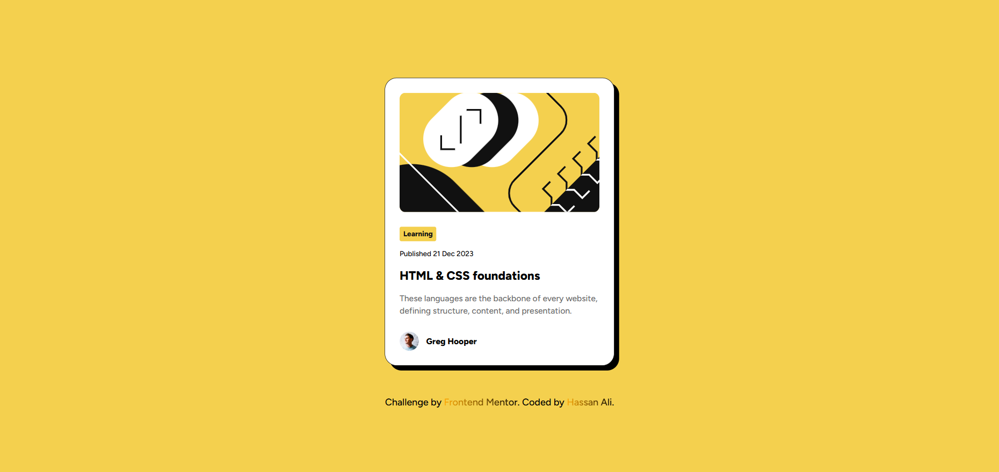
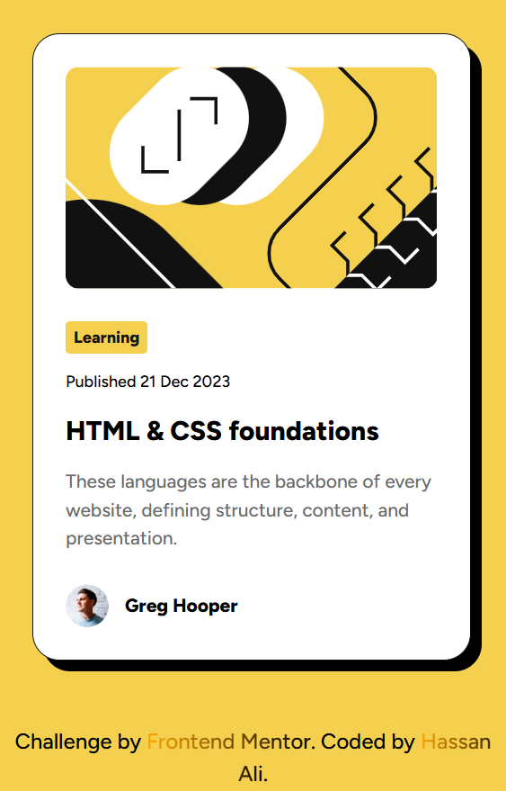

# Frontend Mentor - Blog preview card solution

This is my solution to the [Blog preview card challenge](https://www.frontendmentor.io/challenges/blog-preview-card-ckPaj01IcS) on Frontend Mentor.  
Frontend Mentor challenges help you improve your coding skills by building realistic projects.

---

## Overview

### The challenge

Users should be able to:

- See hover states for the blog title
- View the optimal layout depending on their device’s screen size

### Screenshots

**Desktop**

**Mobile**  

### Live Demo

[View Live Demo](https:/)

## My process

### Built with

- Semantic **HTML5 markup** (`<article>`, `<time>`, etc.)
- **CSS custom properties** for theme colors and font
- **Grid** for centering
- **Flexbox** for layout
- **Clamp()** for responsive width without media queries
- Mobile-first workflow

### What I Learned

This project gave me a chance to strengthen my understanding of semantic HTML and modern CSS techniques. Some key takeaways:

- Using proper semantic tags: `h1`/`h2` for section titles, `
` and `` for the author name, and `<time>` for the publish date.
- I already knew how to use `clamp()` for responsive fonts, but in this project I applied it for component widths. It worked perfectly and reduced the need for media queries.

## Author

👤 **Hassan Ali**
Frontend Mentor - [@hassan-ali-byte](https://www.frontendmentor.io/profile/hassan-ali-byte)  
GitHub - [hassan-ali-byte](https://github.com/hassan-ali-byte)

---

✨ Thanks for checking out my solution! Feedback and suggestions are always welcome.
